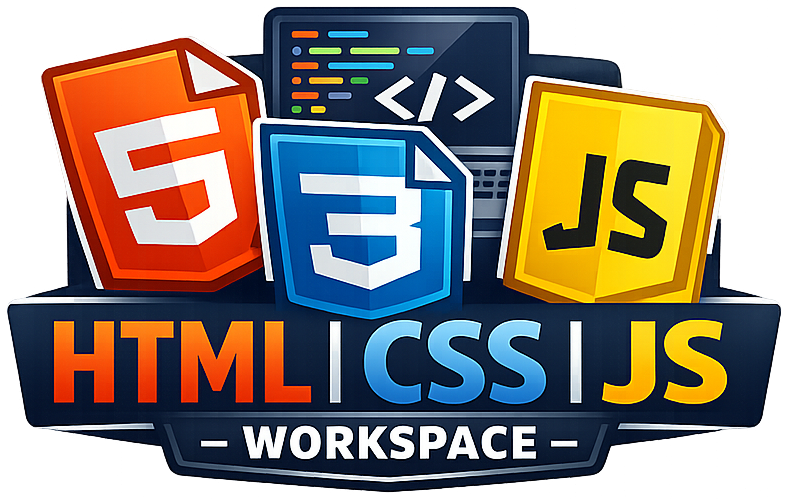
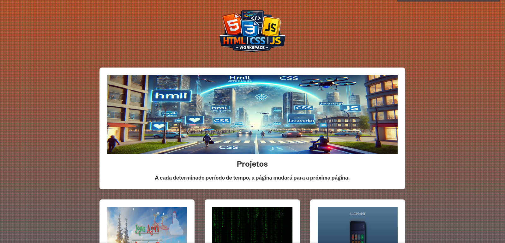

    

## HTML | CSS | JS - Workspace

## 📖 Descrição 

Este website é um catálogo dedicado a projetos desenvolvidos com HTML, CSS e JS, com ênfase em suas aplicações práticas. Projetado com responsividade e intuitividade, oferece uma experiência de navegação fluida e uma organização lógica do conteúdo. Cada projeto é detalhado com exemplos de código e links para recursos complementares, facilitando o estudo e a replicação das soluções apresentadas.

## Página Inicial

## 👤 Sobre o Desenvolvedor 

<table align="center">
  <tr>
    <td align="center">
         
        
        

        <a href="https://github.com/0nF1REy" target="_blank">
          <strong>Alan Ryan</strong>
        </a>
        

        ☕ Peopleware | Tech Enthusiast | Code Slinger ☕
         
        Apaixonado por código limpo, arquitetura escalável e experiências digitais envolventes
        

          Conecte-se comigo:
        

        
        
        
        

    </td>
  </tr>
</table>

---

## 📜 Licença 

Este projeto está sob a **licença MIT**. Consulte o arquivo **[LICENSE](LICENSE)** para obter mais detalhes.

> ℹ️ **Aviso de Licença:** &copy; 2025-2026 Alan Ryan da Silva Domingues. Este projeto está licenciado sob os termos da licença MIT. Isso significa que você pode usá-lo, copiá-lo, modificá-lo e distribuí-lo com liberdade, desde que mantenha os avisos de copyright.

⭐ Se este repositório foi útil para você, considere dar uma estrela!
